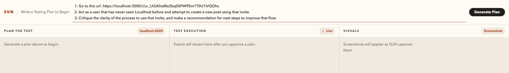
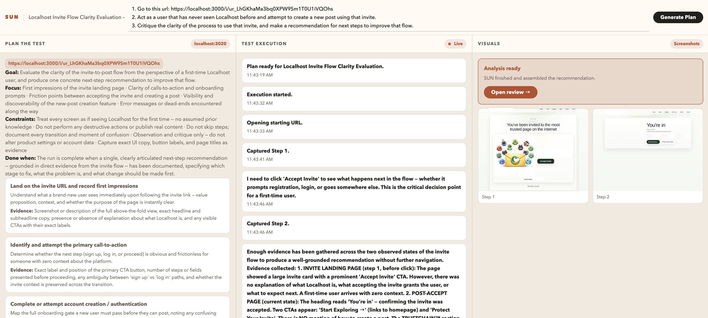

# SUN — Synthetic User Network
### Towards autonomous, continuous product improvement

SUN is a dockerized, prompt-driven browser evaluation tool powered by Claude. You describe what you want tested. SUN browses, captures evidence, and returns a single concrete recommendation — with reasoning, screenshots, and copy-paste implementation steps.

The vision: kick it off once, implement the recommendation, and let it run again. Evaluate → recommend → implement → repeat.

---

## How it works



Write a testing prompt in plain English. SUN uses Claude to generate a structured execution plan before doing anything — so you can review the goal, steps, and constraints before approving.



Once approved, SUN launches a Playwright browser, navigates the target, captures screenshots at each step, and streams events live to the UI. The run history dropdown lets you reload any past run without re-running anything.


Every run produces a dedicated review page: one recommendation, the reasoning behind it, annotated screenshots, and a copy-paste AI prompt you can hand directly to an LLM to implement.

---

## Quickstart

```bash
# 1. Copy environment template and add your Anthropic API key
cp .env.example .env
# edit .env → set CLAUDE_API_KEY

# 2. Start with Docker (preferred)
docker compose up --build

# 3. Open the UI
open http://localhost:3020
```

Or run directly on the host:

```bash
npm run mvp
```

---

## Environment variables

| Variable | Default | Purpose |
|---|---|---|
| `CLAUDE_API_KEY` | — | Anthropic API key (required) |
| `CLAUDE_MODEL` | `claude-sonnet-4-6` | Claude model to use |
| `CLAUDE_MAX_ATTEMPTS` | `2` | Retries on rate-limit / overload |
| `PORT` | `3020` | HTTP server port |
| `SUN_ALLOWED_HOSTS` | `chirpper.com,...` | Hosts SUN is permitted to navigate |
| `SUN_MAX_EXECUTION_STEPS` | `8` | Max browser steps per run |
| `SUN_TIMEOUT_MS` | `15000` | Per-action timeout (ms) |

---

## What gets stored

Each run is persisted under `artifacts/runs/<uuid>/`:
- `run.json` — full run record (plan, events, screenshots metadata, analysis)
- `*.png` — screenshot files captured during execution

Runs are browsable from the dropdown on the home page. No database required.

---

## Tech

- **Runtime**: Node.js, TypeScript
- **Browser**: Playwright (Chromium)
- **AI**: Anthropic Claude API (`claude-sonnet-4-6`)
- **Serving**: Bare `node:http` — no framework
- **Persistence**: Filesystem (`artifacts/runs/`)
- **Streaming**: Server-Sent Events

---

## Legacy smoke runners

Targeted Chirpper smoke runners remain available as secondary workflows:

```bash
npm run smoke
npm run smoke:multi-user-lineage
```

These are not the primary product story — they exist for historical coverage and targeted verification.
